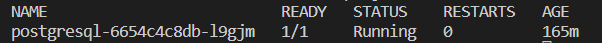
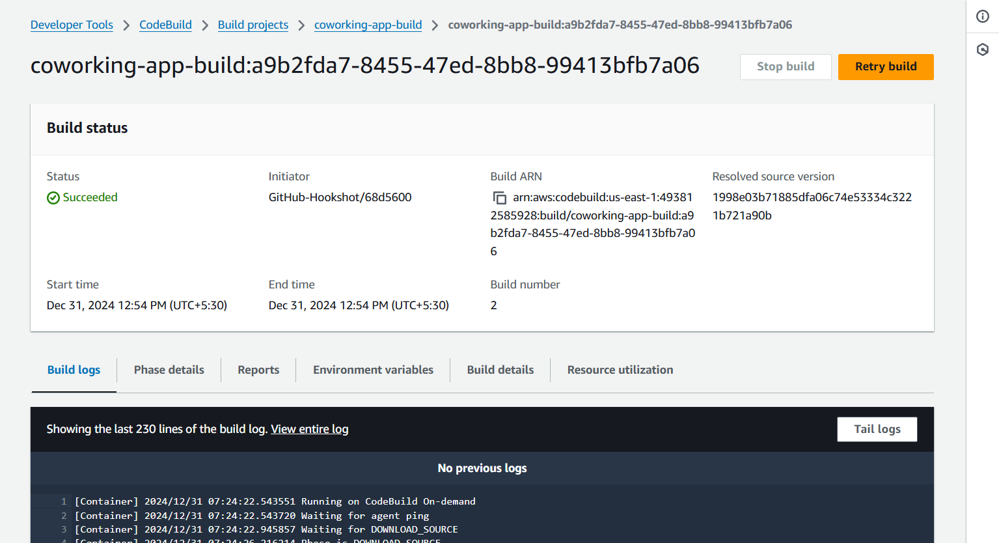
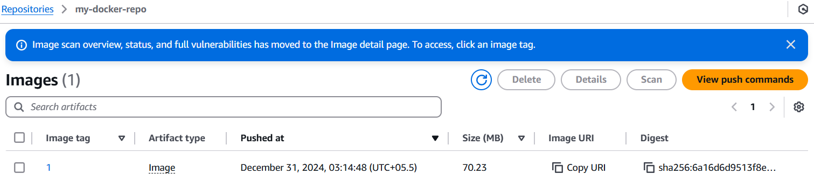
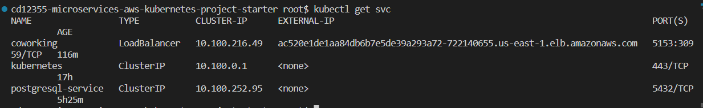
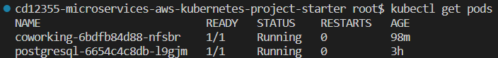
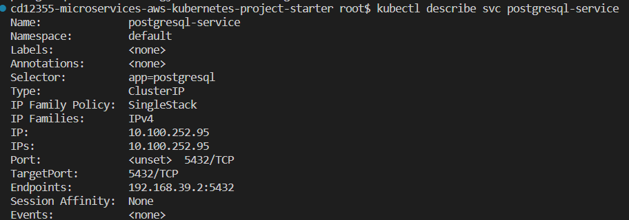
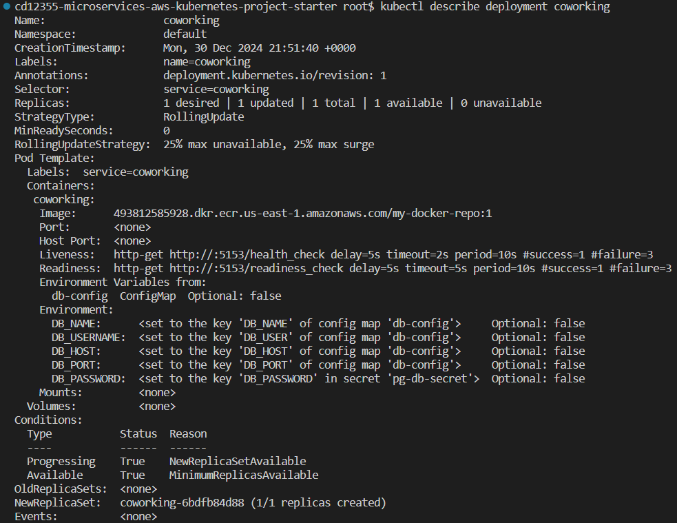
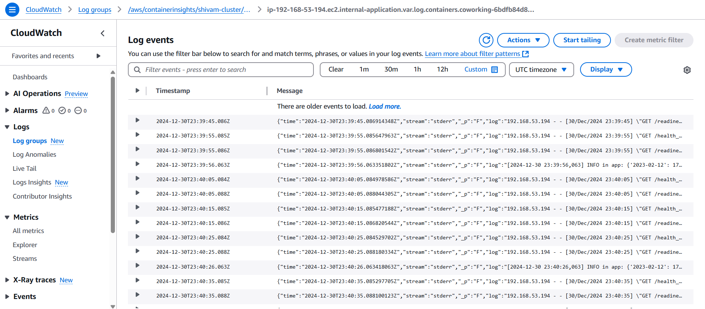
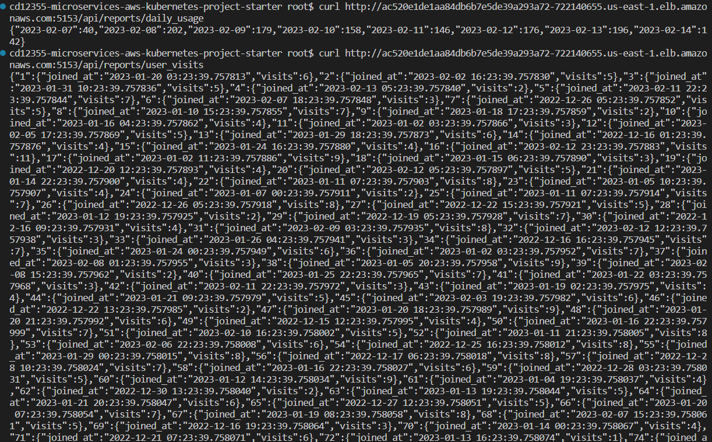

# Project - Operationalizing a Coworking Space Microservice

## Navigation

### 1. [Deployment Steps](#steps-to-follow-to-deploy-the-application)
### 2. [Project Rubric](#2-project-rubric)

## Steps to follow to deploy the application

### 1. Create an `EKS cluster`
```bash
eksctl create cluster --name shivam-cluster --region us-east-1 --nodegroup-name shivam-ng --node-type t3.small --nodes 1 --nodes-min 1 --nodes-max 2
```

#### Note
- I have used t3.small as for small-scale or non-production environments with low traffic, a t3.small instance is a cost-effective solution that can handle light PostgreSQL workloads
- To save costs, we can also:
    - Consider t3.micro, as our database workload is very light, consider using a t3.micro instance to further reduce costs while still benefiting from burstable performance.
    - Use Aurora Serverless, if in future, our workload varies, Amazon Aurora Serverless for PostgreSQL can automatically scale up and down, allowing you to only pay for the capacity you use, which can be more cost-efficient for fluctuating traffic.

---

### 2. Update `kubeconfig`
```bash
aws eks update-kubeconfig --region us-east-1 --name shivam-cluster
```
This updates the `kubeconfig` in your machine to point to the cluster you've created.

---

### 3. Setup Database

##### 3.1 Deploy the DB
```bash
    kubectl apply -f deployment/pv.yml
    kubectl apply -f deployment/pvc.yml
    kubectl apply -f deployment/pg-deployment.yml
    kubectl apply -f deployment/pg-service.yml
```

##### 3.2 Setup schema and data
```bash
# Port forwarding
kubectl port-forward --address 127.0.0.1 service/postgresql-service 5433:5432 &
# Extract and export the password from secret in cluster
export DB_PASSWORD=`kubectl get secret pg-db-secret -o jsonpath='{.data.DB_PASSWORD}' | base64 --decode`
# Create Tables
PGPASSWORD="$DB_PASSWORD" psql --host 127.0.0.1 -U ${DB_USER} -d ${DB_NAME} -p 5433 < ./db/1_create_tables.sql
# Populate users table
PGPASSWORD="$DB_PASSWORD" psql --host 127.0.0.1 -U ${DB_USER} -d ${DB_NAME} -p 5433 < ./db/2_seed_users.sql
# Populate tokens table
PGPASSWORD="$DB_PASSWORD" psql --host 127.0.0.1 -U ${DB_USER} -d ${DB_NAME} -p 5433 < ./db/3_seed_tokens.sql
```

---

### 4. Deploy environment variables
```bash
kubectl apply -f deployment/configmap.yaml
```

This step configures variables such as DB username, host, port, secret, etc., which will be required by the app when it starts.

---

### 5. Deploy the app
```bash
kubectl apply -f deployment/coworking.yaml
```
Deploys the application to the EKS cluster

---

### 6. Enable logging

To enable logging for the cluster nodes, two steps are required:
    - Attach CloudWatch IAM policy to the worker nodes role
    - Install the CloudWatch Logs Agent for EKS

```bash
# Attach policy
aws iam attach-role-policy \
--role-name eksctl-shivam-cluster-nodegroup-sh-NodeInstanceRole-AQqeTSnku4Gz \
--policy-arn arn:aws:iam::aws:policy/CloudWatchAgentServerPolicy

# Install CloudWatch agent/add-on to the cluster
aws eks create-addon --addon-name amazon-cloudwatch-observability --cluster-name shivam-cluster
```

#### Note

The policy can also be attached from the AWS console by navigating to roles in AWS IAM service

---

## Project Rubric

### 1. Set up a Postgres database.


### 2. Create a Dockerfile for the Python application.
[Dockerfile](Dockerfile)

### 3. Write a simple build pipeline with AWS CodeBuild to build and push a Docker image into AWS ECR.
[buildspec.yml](buildspec.yml)

### 4. Take a screenshot of AWS CodeBuild pipeline for your project submission.


### 5. Take a screenshot of AWS ECR repository for the application's repository.


### 6. Create a service and deployment using Kubernetes configuration files to deploy the application.
- [pv.yml](deployment/pv.yml)
- [pvc.yml](deployment/pvc.yml)
- [pg-deployment.yml](deployment/pg-deployment.yml)
- [pg-service.yml](deployment/pg-service.yml)
- [configmap.yml](deployment/configmap.yaml)
- [coworking.yml](deployment/coworking.yaml)

### 7. Take a screenshot of running the kubectl get svc command.


### 8. Take a screenshot of kubectl get pods.


### 9. Take a screenshot of kubectl describe svc <DATABASE_SERVICE_NAME>.


### 10. Take a screenshot of kubectl describe deployment <SERVICE_NAME>.


### 11. Take a screenshot of AWS CloudWatch Container Insights logs for the application.


### 12. API calls and output
```bash
curl http://ac520e1de1aa84db6b7e5de39a293a72-722140655.us-east-1.elb.amazonaws.com:5153/api/reports/daily_usage
curl http://ac520e1de1aa84db6b7e5de39a293a72-722140655.us-east-1.elb.amazonaws.com:5153/api/reports/user_visits
```


